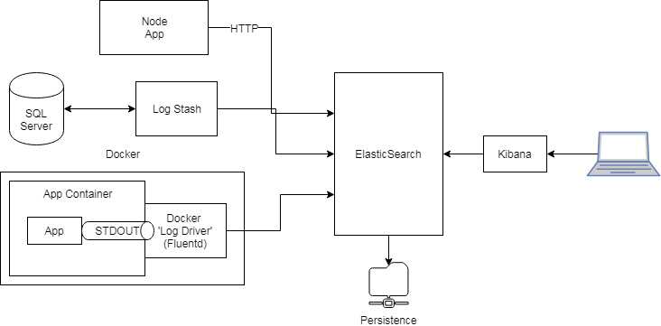

# Log Services


## Current POC Architecture

The POC consists of three parts:

* A Node app writing directly to ElasticSearch over HTTP
* A LogStash instance reading entries from SQL Server on an interval, and pushing new rows to Elastic Seaaarch
* An App running in Docker, writing to STDOUT. The Fluentd Docker Log Driver reads the STDOUT and pushes logs to ElasticSearch.




## Starting Services

#### Copy Files

```
scp -r -i c:/secrets/cscadmin.key efk-stack/  cscadmin@dev-dock-006:~/
```

#### Standup Portainer Instance

```
docker volume create portainer_data
docker run -d -p 9000:9000 --name portainer --restart always -v /var/run/docker.sock:/var/run/docker.sock -v portainer_data:/data portainer/portainer
```

#### Initialize Swarm

To use secrets you need to be in docker swarm mode. To do this run `docker swarm init`.

```
docker swarm init
```

### Configuring Secrets

Secrets need to be configured before running `docker-compose`

```bash
$ echo <secret> | docker secret create CSC_App_ConcordLog_Dev_Password -
```

head -n 1 secret_test.txt | docker secret create CSC_App_ConcordLog_Dev_Password -

#### Create/run local docker registry

```
docker run -d -p 5000:5000 --restart=always --name registry registry:2
```

#### Build and Push Images to Local Registry

This gets us around the issues described below.

```
docker-compose build
docker-compose push  #pushes an image to a registry, uses the 'image' proerty in the service's config
```


`docker-compose up` cannot be used when secrets are involved (see [Docker Issue](https://github.com/docker/compose/issues/6169)). If you do use them, you'll see a message like:

```
WARNING: Service "sql-concord-logger" uses secret "CSC_App_ConcordLog_Dev_Password"ernal. External secrets are not available to containers created by docker-compose.
```


#### Deploy the Stack

```
docker stack deploy -c docker-compose.yml efk-stack
```

#### Finished

#### Debugging

Use this if a task is failing
```
docker service ps <ID_of_Service> -q | head -n 1 | xargs docker inspect
# OR
docker service ps <ID_of_Service> -q | head -n 1 | xargs docker service logs -f
```
The result is an inspect object and in it often has a cause of the failure


https://docs.docker.com/config/containers/logging/configure/

> Docker includes multiple logging mechanisms to help you get information from running containers and services. These mechanisms are called logging drivers.


https://docs.docker.com/config/containers/logging/


> In some cases, docker logs may not show useful information unless you take additional steps.
> If you use a logging driver which sends logs to a file, an external host, a database, or another logging back-end, docker logs may not show useful information.
> If your image runs a non-interactive process such as a web server or a database, that application may send its output to log files instead of STDOUT and STDERR.
> In the first case, your logs are processed in other ways and you may choose not to use docker logs. In the second case, the official nginx image shows one workaround, and the official Apache httpd image shows another.
> The official nginx image creates a symbolic link from /var/log/nginx/access.log to /dev/stdout, and creates another symbolic link from /var/log/nginx/error.log to /dev/stderr, overwriting the log files and causing logs to be sent to the relevant special device instead. See the Dockerfile.
> The official httpd driver changes the httpd application’s configuration to write its normal output directly to /proc/self/fd/1 (which is STDOUT) and its errors to /proc/self/fd/2 (which is STDERR). See the Dockerfile.


## Deliver Mode of Log Messages

https://docs.docker.com/config/containers/logging/configure/#configure-the-delivery-mode-of-log-messages-from-container-to-log-driver

Configure the delivery mode of log messages from container to log driver Docker provides two modes for delivering messages from the container to the log driver:

* (default) direct, blocking delivery from container to driver
non-blocking delivery that stores log messages in an intermediate per-container ring buffer for consumption by driver
* The non-blocking message delivery mode prevents applications from blocking due to logging back pressure. Applications are likely to fail in unexpected ways when STDERR or STDOUT streams block.

WARNING: When the buffer is full and a new message is enqueued, the oldest message in memory is dropped. Dropping messages is often preferred to blocking the log-writing process of an application.

The mode log option controls whether to use the blocking (default) or non-blocking message delivery.

The max-buffer-size log option controls the size of the ring buffer used for intermediate message storage when mode is set to non-blocking. max-buffer-size defaults to 1 megabyte.

The following example starts an Alpine container with log output in non-blocking mode and a 4 megabyte buffer:

$ docker run -it --log-opt mode=non-blocking --log-opt max-buffer-size=4m alpine ping 127.0.0.1

#### Logging Best Practces
https://success.docker.com/article/logging-best-practices

Application Logs
Application-produced logs can be a combination of custom application logs and the STDOUT/STDERR logs of the main process of the application. As described earlier, the STDOUT/STDERR logs of all containers are captured by the Docker Engine default logging driver. So, no need to do any custom configuration to capture them. If the application has custom logging ( e.g. writes logs to /var/log/myapp.log within the container), it's important to take that into consideration.


#### Fluentd Logging Driver

https://docs.docker.com/config/containers/logging/fluentd/


**Objectives**
* Need to do the SQL stmts
* Research workign with STDOUT/STDERR
* What are *NIX best practices around logging
* How to move logs to a particular folder 
  * Could we use a log aggregator to move the files? Is it the right thing to do
* Research Alerting
* Research health monitoring of services - tools to use


## TODO

Use [JSON appsettings.json configuration](https://github.com/serilog/serilog-sinks-file#json-appsettingsjson-configuration) to output JSON formatted logs

##### JSON event formatting
To write events to the file in an alternative format such as JSON, pass an ITextFormatter as the first argument:

```
.WriteTo.File(new CompactJsonFormatter(), "log.txt")
```

##### Shared log files

To enable multi-process shared log files, set shared to true:

```
    .WriteTo.File("log.txt", shared: true)
```


### Reference


Good article on logging best practices
https://logmatic.io/blog/beyond-application-monitoring-discover-logging-best-practices/

### Further Research

#### Monitoring

[USE FILE-BASED SERVICE DISCOVERY TO DISCOVER SCRAPE TARGETS](https://prometheus.io/docs/guides/file-sd/)

Can use [node_exporter](https://github.com/prometheus/node_exporter) to monitor *NIX hardware and OS metrics.


### Ideas

#### Configuration Exposed through URL

Can we expose configuration through an exposed http url endpoint?!?!

See: `kubectl create -f https://k8s.io/examples/pods/security/security-context.yaml`

https://kubernetes.io/docs/tasks/configure-pod-container/security-context/#set-the-security-context-for-a-pod

#### Microsoft.Extensions.Logging

Look at `Microsoft.Extensions.Logging`


## Log Mgmt in *NIX

Could use `Rsyslog` to move logs from local to remote server
https://www.loggly.com/ultimate-guide/managing-linux-logs/

> Many applications add some sort of date time stamp in them. This makes it much more difficult to find the latest file and to setup file monitoring by rsyslog. A better approach is to add timestamps to older log files using logrotate. This makes them easier to archive and search historically.

> Linux best practice usually suggests mounting the /var directory to a separate file system. This is because of the high number of I/Os associated with this directory. We would recommend mounting /var/log directory under a separate disk system. This can save I/O contention with the main application’s data. Also, if the number of log files becomes too large or the single log file becomes too big, it doesn’t fill up the entire disk.

> When logrotate copies a file, the new file has a new inode, which can interfere with rsyslog’s ability to monitor the new file. You can alleviate this issue by adding the copytruncate parameter to your logrotate cron job. This parameter copies existing log file contents to a new file and truncates these contents from the existing file. The inode never changes because the log file itself remains the same; its contents are in a new file.
> The logrotate utility uses the main configuration file at /etc/logrotate.conf and application-specific settings in the directory /etc/logrotate.d/. DigitalOcean has a detailed tutorial on logrotate.


## Setting Up a Logging Framework

**Objective:** What are the pieces to a modern logging framework. Will focus on getting logs forwarded to a centralized platform.


**Goals:**

* Git pull ELK stack image - Complete
* Get ELK stack up and data flowing through - Complete
* Logstash and/or Fluentd - Retrieve data from SQL Server
* Logstash and/or Fluentd - Retrieve data from RabbitMQ


[Setting up a ELK stack in Docker](https://logz.io/blog/docker-logging/)


## Standup SQL Server Instance For Testing

[Run SQL Server container images with Docker](https://docs.microsoft.com/en-us/sql/linux/quickstart-install-connect-docker?view=sql-server-2017)

Pull the SQL Server Docker Instance

```
docker pull mcr.microsoft.com/mssql/server:2017-latest
```

Start the SQL Server instance

```
docker run -e 'ACCEPT_EULA=Y' -e 'SA_PASSWORD=Solution1' \
  -p 1433:1433 --name sql1 \
  -d mcr.microsoft.com/mssql/server:2017-latest
```

Check to see if the instance is up.

```
docker ps
```

### Get sqlcmd Working

Either use the [docker container](https://hub.docker.com/r/microsoft/mssql-tools/)

```
docker pull mcr.microsoft.com/mssql-tools
docker run -it mcr.microsoft.com/mssql-tools
```

Or Ubuntu

(Install sqlcmd on Ubuntu)[https://docs.microsoft.com/en-us/sql/linux/sql-server-linux-setup-tools?view=sql-server-2017#ubuntu]

```
curl https://packages.microsoft.com/keys/microsoft.asc | sudo apt-key add -
curl https://packages.microsoft.com/config/ubuntu/16.04/prod.list | sudo tee /etc/apt/sources.list.d/msprod.list
sudo apt-get update 
sudo apt-get install mssql-tools unixodbc-dev

echo 'export PATH="$PATH:/opt/mssql-tools/bin"' >> ~/.bash_profile
```

Or on Mac

```
# brew untap microsoft/mssql-preview if you installed the preview version
brew tap microsoft/mssql-release https://github.com/Microsoft/homebrew-mssql-release
brew update
brew install --no-sandbox mssql-tools
#for silent install:
#ACCEPT_EULA=y brew install --no-sandbox mssql-tools
```

#### Interact with `sqlcmd`, Create Log Database

Connect to the SQL instance

```
# sqlcmd -U sa -P Solution1 -S localhost
> select @@version
> go
```

List Databases in instance

```
select name, database_id from sys.databases
```

```
CREATE DATABASE logs
go

ALTER LOGIN sa with default_database = logs
go

CREATE TABLE log (ID int IDENTITY(1,1) PRIMARY KEY, loglevel varchar(255), message varchar(255), stacktrace varchar(255))
go

--check table was created
SELECT * FROM INFORMATION_SCHEMA.TABLES WHERE TABLE_TYPE='BASE TABLE'
go

SELECT * FROM dbo.log
go

INSERT INTO log (loglevel, message, stacktrace) VALUES ('ERR', 'This Broke', 'Method Line:123')
go

INSERT INTO log (loglevel, message, stacktrace) VALUES ('WRN', 'Just a warning', 'Method Line:345')

```

#### JDBC ODBC Connection to SQL Server

Validata Java is installed (if not, figure out how to get it installed)

```
java -version
```

If not, install Java.

Linux:

```
apt-get install default-jdk
```


[Download Microsoft JDBC Driver for SQL Server](https://docs.microsoft.com/en-us/sql/connect/jdbc/download-microsoft-jdbc-driver-for-sql-server?view=sql-server-2017)

[Jdbc input plugin](https://www.elastic.co/guide/en/logstash/current/plugins-inputs-jdbc.html)


### Logstash

#### Install LogStash

[Directions to install Logstash](https://www.elastic.co/guide/en/logstash/current/installing-logstash.html)

[Download Logstash](https://www.elastic.co/downloads/logstash)

##### Send a Message

[Send first Logstash event](https://www.elastic.co/guide/en/logstash/current/first-event.html)

Run this command: (Note: it may take a moment to spin up.)

```
./../bin/logstash-6.4.2/bin/logstash -e 'input { stdin { } } output { stdout {} }'
```

Once you see `Successfully started Logstash API endpoint` you can type an input, press ENTER, and the message will be output in a structured format.

#### Extract Logs from SQL Server

We'll use a plugin to pull data from SQL Server: [Logstash - Extract Logs from SQL Server DB](https://www.elastic.co/guide/en/logstash/current/plugins-inputs-jdbc.html)

Use the `-f` command to define the location of the config file. Example: `-f logstash-filter.conf`

Configuration Example:

```
input {
 jdbc {
   jdbc_driver_library => "./../bin/sqljdbc_7.0/enu/mssql-jdbc-7.0.0.jre8.jar"
   jdbc_driver_class => "com.microsoft.sqlserver com.sqlserver.jdbc.Driver"
   jdbc_connection_string => "jdbc:sqlserver://localhost:1433;databaseName=master;user=sa;password=Solution1"
   jdbc_user => "sa"
   schedule => "* * * * *"
   statement => "SELECT id, loglevel, message, stacktrace FROM log WHERE id > :sql_last_value"
   use_column_value => true
   tracking_column => "id"
   last_run_metadata_path => "./last_run_metadata_path"
 }
}

output {
 stdout {}
}
```

> sql_last_value:  The value used to calculate which rows to query. Before any query is run, this is set to Thursday, 1 January 1970, or 0 if use_column_value is true and tracking_column is set. It is updated accordingly after subsequent queries are run.

Command to run:

```
./../bin/logstash-6.4.2/bin/logstash -f logstash-sqlserver.config
```


### Fluentd

Install FluentD on Windows
https://docs.fluentd.org/v1.0/articles/install-by-msi


### Items to Look At

[Moving Data from SQL Server to Elastic](https://codeshare.co.uk/blog/how-to-copy-sql-server-data-to-elasticsearch-using-logstash/)

[Loading large datasets into SQL Server](https://instarea.com/heavy-load-ms-sql-elasticsearch/)


